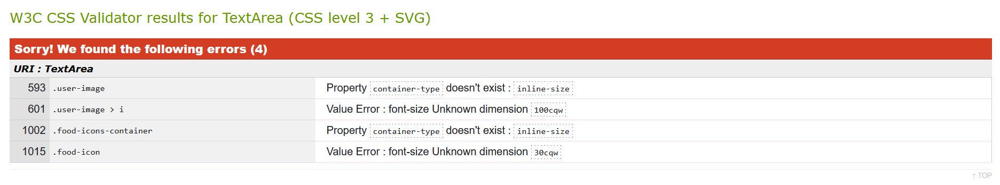
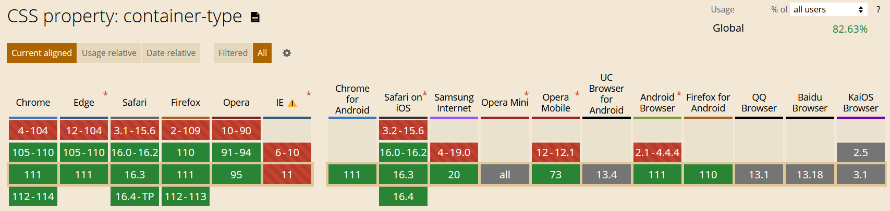
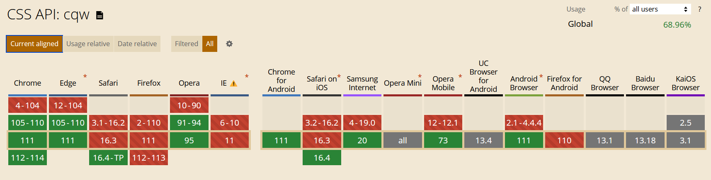
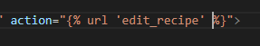
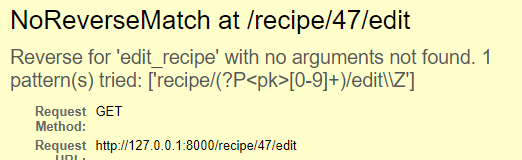
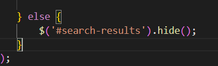

# yummy

Yummy is a recipe book web application, that allows users to save and store their recipes and access them from any device.

It is designed to fit both small and big screens.

[See deployed website](https://yummy-recipe-book.herokuapp.com/)

## Table of content

- [Design and User Experience](#design-and-user-experience)
  - [Design](#design)
  - [User Stories](#user-stories)
  - [Database model](#database-models)
  - [Wireframes](#wireframes)

- [Features](#features)
  - [Landing Page](#landing-page)
  - [Dashboard](#dashboard)
  - [My Recipes page](#my-recipes)
  - [CRUD](#crud)
  - [Profile page](#profile-page)

- [Testing](#testing)
  - [Tests](#tests)
  - [Validator Testing](#validator-testing)
  - [Fixed bugs](#fixed-bugs)
  - [Unfixed bugs](#unfixed-bugs)
  - [Performance](#performance)

- [Deployment](#deployment)
  - [Live Website](#live-website)
  - [Local Deployment](#local-deployment)

- [Credits](#credits)
  - [Code](#code)
  - [Content](#content)

- [Technologies used](#technologies-used)

- [Acknowledgements](#acknowledgements)

## Design and User Experience

The web app was developed following the Agile methodology, utilizing the project functionality provided by GitHub
[Link to the project board](https://github.com/users/EliSacch/projects/5/views/1)

### Design

- Color palette:
  - Gradient:

  

  - Neutral:

  

  - Contrast:

  
  

[Back to the top](#table-of-content)

### User Stories

- As a website user I can log into my personal area so that I can save and see my own recipes and not the ones from other users.

- As a first-time user I can receive a confirmation email when I sign up so that I know I entered the correct email.

- As a user I can reset my password so that I can recover access if I forgot my password.

- As a user I can have a dashboard with a clean design and clear navigation so that I know how to use all the features.

- As a user I can see and edit my personal information so that I can keep my information up to date.

- As a user I can add my recipe so that I can have them saved and I am able to review them whenever I need.

- As a user I can click on my recipes cards so that I can see all the details.

- As a user I can edit my recipes so that I don't need to delete them and add them from scratch if I want to change something.

- As a user I can delete a recipe so that I can keep just the ones I like.

- As a user I can search my recipes by name so that I don't have to scroll all the recipes to find the one I need.

- As a user I can see some random suggestions so that I can be inspired by my previous recipes.

[Back to the top](#table-of-content)

### Database Models

There are four needed models: User, Recipe, Ingredient, UserProfileImage.

- User:
The User model is provided by Django Allauth package.

The following Models are custom:

- UserProfileImage:
It is a OneToOneField that is linked to the User model. It is used to store the user profile image, which is not mandatory.

- Recipe:
It is a model that stores the recipe information. It is linked to the User model, so that each user can have their own recipes.

- Ingredient:
It is a model that stores the ingredients information. It is linked to the Recipe model, so that each recipe can have their own ingredients.

[Back to the top](#table-of-content)

### Wireframes

  
Mobile

   
   
   
   
   
   
   
   
   

  
Desktop

   
   
   
   
   
   

[Back to the top](#table-of-content)

## Features 

### Landing page

The landing page is the first page that the user sees when they visit the website. It is a simple page with a call to action button that redirects the user to the signup or login page (if they are not logged in), or to the dashboard (if they are logged in).

- __Login__

  - the user can use both username or password to login.
  - They have the option to reset the password if needed.

  
Screenshot

  

- __Signup__

  - The user must enter a valid email address and a password.
  - The user will receive a confirmation email to verify the email address.

  
Screenshot

  

[Back to the top](#table-of-content)

### Dashboard

- __Header__

  - The header contains the user handle, the user profile image (or an icon if the user has not uploaded an image), and the navigation bar.

  - The navigation bar collapses into a sidebar on mobile devices.

  - The user can click on the user profile image to access the profile page.

  - The navigation bar allows access to the following features:
  
    - __Home__ - redirects to the home page.
  
    - __Add recipe__ - redirects to the add recipe page.
  
    - __All recipes__ - redirects to another page where the user can see all their recipes.
  
    - __Logout__ - logs out the user and redirects to the landing page.

  
Screenshots

  Desktop:

  

  Mobile:

  

- __No recipe message__

  - If the user has not added any recipe, the dashboard will show a message that prompts the user to add a recipe.

  

- __Search__

  - The user can search the recipes by name from the dashboard.

  - If the user clicks on the name of the recipes in the search result they are redirected to the recipe detail page.

  
Screenshot

  

- __Categories__

  - The Categories section contains the list of tags that the user entered for their recipes.

  - The suer can click on the tag to be redirected to a new page with the recipes filtered by the selected tag.

- __Suggestions__

  - Not all the recipes are displayed on the dashboard, so that it can remain more clear and it is easier for the user to find the desired feature.

  - Although up to 5 random recipes are displayed, so that the user can be inspired by the previously added recipes.

  - This section contains also a quick-link to access the "my recipes" page, where the user can access all the added recipes.

[Back to the top](#table-of-content)

### My Recipes

In this page the user can see all their recipes.

- __Filters__

  - The user can filter by keywords in title, by one or multiple tags, and/or by difficulty.

  
Screesnhot

  

- __Results__

  - The results are displayed in cards, split in multiple pages if needed, up to six results per page.

  - The user can easily change page using the paginator right underneeth the results.

  
Screenshot

  

[Back to the top](#table-of-content)

### CRUD

- __Create__

  - The add_recipe view offers the main Create functionality to the user, so that they can add and save their recipes.

  - The required fields are marked with an asterisc.

  - The ingredients and procedure are implemented using a formset, so that the user can add as many igredients/steps as they want, by adding and removing ingredient/step lines.

  
Screenshot

  

 

- __Read__

  - The user can click on any recipe card (from the suggestions sections or from my_recipes page) to see all the recipe details.

  - The layout changes on mobile, to allow a cleaner view of the details.

  
Screenshots

  Mobile:

  

  Desktop:

  

 

- __Update__

  - On the top right corner of the detail page there is an edit button.

  - The edit buttons redirects to the edit page, which uses the same form of the 'add recipe' page, but all the fields are pre-populated with the current details.

- __Delete__

  - Next to the edit button there is a delete button.

  - When the delete button is clicked, a model opens for the user to confirm if they really wish to delete the recipe.

  

[Back to the top](#table-of-content)

### Profile page

From this page the user can review and manage the profile and login information.

- __Profile image__

  - The user can click on the edit button to upload or change a profile image.

  
Screenshot

  No image uploaded:

  

  Image uploaded:
  
  

- __Profile details__

  - This section includes the current username, email, and password.

  - There is an edit button next to each detail, so that the user can update each information individually.

  - The password is not shown for security reasons.

  

- __Change username__

  - The username can be edited in place.

  - The system will check that the new username is not already taken, and that it is valid.
  
  - An error message will be displayed if the username is not valid.

  

- __Manage email__

  - The 'manage email' functionality is provided by Django Allauth package.

  - The edit button redirects to a new page where the user can add or remove email addresses, change the primary email address and re-verify them.

  
Screenshot

  

- __change password__

  - The 'change passowrd' functionlity is also managed by Django Allauth package.

  - When clicking on the edit button the user is redirected to a new page, where they can change the password, or click on the 'Forgot Passord' link, if they need to reset it.

  
Screenshot

  

- __Logout__

  - In the profile page there is also a quick-link to log out, which works in the same way as the 'log out' button in the header.

  - Clicking on the button will open a modal, where the user need to confirm that they really want to log out.

  
Screenshot

  

- __Delete account__

  - The user has the option to delete the account.

  - The account deletion is a permanent action, and it will also remove all the recipes associated to the user.

  - For this reason the user needs to check a box and confirm that they really want to permanently delete their account.

  
Screenshot

  

[Back to the top](#table-of-content)

## Testing 

[Back to the top](#table-of-content)

### Tests

[Back to the top](#table-of-content)

### Validator Testing

#### HTML

 Check if errors are returned when passing the final version through the official [W3C validator](https://validator.w3.org/nu/#textarea)

  

  
W3 - HTML validation screenshot

  
  

[Back to the top](#table-of-content)

#### CSS

4 errors are returned when passing the final version through the official [Jigsaw validator](https://jigsaw.w3.org/css-validator/validator)

Although, these errors are caused by a new css property, that is still not widely supported.
  - 2 errors are related to the container-type property.
  - 2 errors are related to the cqw values.

W3 - CSS validation screenshot

These errors can be ignored, for the following reasons:

The Container-type property is actually a valid property, according to W3.

[Check on W3](https://www.w3.org/TR/css-contain-3/#propdef-container-type)

  - Accepted value: 	normal || [ size | inline-size ]
  - Applies to: All elements

Even if not supported on some browser, it does not affect the rest of the style, and it will simply be ignored when not supported.

Check browser support

This property is used, in this particular instance, to make this div a 'container', so that I can use the container-relative size for some chldren elements (cqw in this case)

[Check on W3](https://www.w3.org/TR/css-contain-3/#container-lengths)

This unit is become more an more supprted, although a fallback size was provided in both instances, so that I could reach a similar result also on unsuported browsers.

Check browser support

[Back to the top](#table-of-content)

#### JavaScript

Check if Errors are returned when passing the final version through the official [JsHint validator](https://jshint.com/), but only 4 warnings.

  
JsHint - JS validation screenshot

  

[Back to the top](#table-of-content)

### Fixed Bugs

  
 Unable to load static files on Heroku:

  - Issue: The deployed app is not loading static files correctly, because it seems to add a Cloudinary file path in the middle.

  - Fix: After troubleshooting I could see that the issue was caused by the __DISABLE_COLLECTSTATIC__ Config Var, which I had not removed yet. After removing this Config Var the page loads correctly.

    

  
Error 500 when trying to reset password from Heroku

  - Issue: When trying to reset the password from the deployed website I received Server Error 500.

  - Fix: After troubleshooting I could see that the issue was caused by the Outlook SMTP credentials, and the issue was related not only to the reset password link, but to all SMTP functionalities. I decided to switch to Gmail SMTP which solved the issue.

  
Select Field not displaying options in form

  - Issue: When adding the select field to the 'Add recipes' form, the options where not showing and I could only see the label.

  - Fix: The issue was caused by the Materialize CSS form, which requires for the select fields to be initialized via JS.

  
Index page broke after adding function to provide suggested recipes

  - Issue: To provide the recipes suggestion, the function was filtering the results based on the user ID, so that users can see only their recipes. When I first implemented this option I was logged in as admin. After logging out I received this error.

  - Fix: The issue was caused by the Materialize CSS form, which requires for the select fields to be initialized via JS.

  
Randomize icons JS error

  - Issue: I have created a custom image placehoder to display when the user does not upload an image for the recipe. The functions creates random food icons and assign a random position.

  The function was working and displaying the icons in random positions, although it was giving an error in the console.

  

  This is the original code:

  

  - Fix: To fix this issue I changed the code as follow:

  

  
Update form creates new instance instead of updating the existing one

  - Issue numer 1: After creating the UpdateView for my recipes, the view was showing the correct template and pre-populating the fields with the selected recipe to be updated.
  Although when clicking on "Save", the form was crating a new instance, instead of updating the existing one.

  After investigation I could determine that the issue was created by the action url in the form, that was pointing to the add_recipe ursl, instead of edit_recipe url:
    

  - Fix: to solve this issue I changed the action url so that it could point to the correct url:
  

  - Issue numer 2: After changing this url although I received a second error, since the edit_url requires an argument (the primary key of the recipe):
    

  - Fix: To solve this issue I had to add 'pk' as argument for the link, and I had to pass the pk also in the context.

  
  

  
Username Form disappears if invalid form

  - Issue: When updating the usename form the ProfileView, if the form was invalid, the error message was displaying correctly, but the form field disappeared completely.

  

  - Fix: To fix this error, instead of returning "super().form_invalid(form)", I opted to redirect the user to the same page.
  The field reloads correctly, and an error message informs the user that the choosen username was invalid.

  
Search results not clearing if there is no value in the searchbar

  - Issue: When looking for recipes by name, the results are shown dynamically uderneatch the search bar. After some results were found, if the user tried and deleted all the charachters in the search field, the search result div was still showing the last results found.
  This was caused by the fact that all the logic was contained in the 'if' statement, which is fired only if the search string is longer then a minChar value. When deleting charachters from the search bar, the length of the search string was falling below the minChar value, so the search results array was not cleared.

  

  - Fix: To solve this issue I added an else statement, that hides the search results if the search string length is less then the minChar value.

  

  
 

[Back to the top](#table-of-content)

### Unfixed Bugs

[Back to the top](#table-of-content)

### Performance

[Back to the top](#table-of-content)

## Deployment

### Deployment on Heroku

### Local Deployment
  - For a local deployment follow these steps:
    - Create a new directory on your machine, where you want do deploy the files
    - Open the existing repository in GitHub
    - Go to the "Code" tab
    - Click on the "Code" button
    - Copy the HTTPS link
    - Open your terminal and run the command __git clone 'link'__
    - use the link just copied, without quotes, instead of 'link'

[Back to the top](#table-of-content)

## Credits 

### Code

- The code to filter the recipes by tag in the admin page is taken from [bradmontgomery](https://bradmontgomery.net/blog/django-admin-filters-arrayfields/)

- The code to dynamically add ne forms is taken from [CodingEnterpreneur tutorial](https://www.youtube.com/watch?v=s3T-w2jhDHE&t=1293s)

- The code to send an ajax request to show the search results is taken from [Very Academy tutorial](https://www.youtube.com/watch?v=Ct34iiOltgo)

### Content

- The color palette was generated using [Color Space](https://mycolor.space/)
- The recipe model was drawn using [Smart Draw](https://www.smartdraw.com/)

- The icons were taken from [Font Awesome](https://fontawesome.com/) and from [Google Fonts Icons](https://fonts.google.com/icons)

- The following fonts, used for the project, are from [Google Fonts](https://fonts.google.com/):
  - Quicksand
  - Source Sans Pro

The following Images are taken from [Unsplash](https://unsplash.com/photos/_h-2jrL9cMU?utm_source=unsplash&utm_medium=referral&utm_content=creditCopyText)

- Background image is from [Mae Mu](https://unsplash.com/@picoftasty?utm_source=unsplash&utm_medium=referral&utm_content=creditCopyText) 

- The favicon is from [Icons8](https://icons8.com/icon/A2GuNMcdfGfC/torta)

[Back to the top](#table-of-content)

## Technologies used

  - HTML
  - CSS
  - JavaScript and JQuery
  - Python
  - Django
  - Materialize
  - PostgreSQL

  Django libraries
  - Allauth
  - inline forms
  - django-filters
  
[Back to the top](#table-of-content)

## Acknowledgements

A special thank to my mentor __Dick Vlaanderen__ for his precious feedback on this project.

Tutor Ed