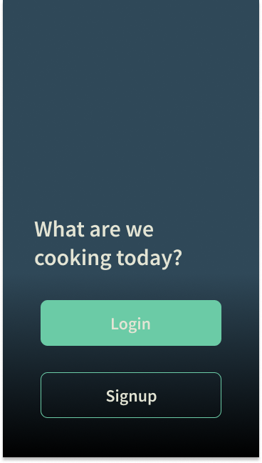
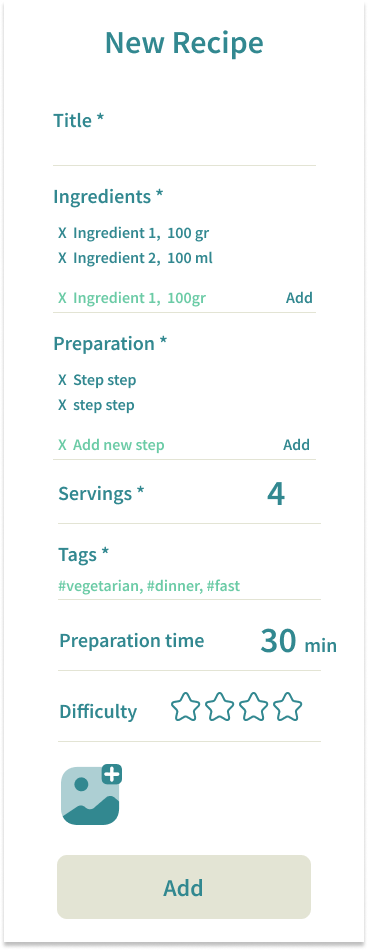

# yummy
Recipe book 

[See deployed website]()

## Table of content

- [Design and User Experience](#design-and-user-experience)
  - [Design](#design)
  - [User Stories](#user-stories)
  - [Recipes database model](#recipes-model)
  - [Wireframes](#wireframes)

- [Features](#features)
  - [Landing Page](#landing-page)
  - [Dashboard](#dashboard)

- [Testing](#testing)
  - [Tests](#tests)
  - [Validator Testing](#validator-testing)
  - [Fixed bugs](#fixed-bugs)
  - [Unfixed bugs](#unfixed-bugs)
  - [Performance](#performance)

- [Deployment](#deployment)
  - [Live Website](#live-website)
  - [Local Deployment](#local-deployment)

- [Credits](#credits)
  - [Code](#code)
  - [Content](#content)

- [Technologies used](#technologies-used)

- [Acknowledgements](#acknowledgements)

## Design and User Experience

### Design

- Color palette:
  - Gradient:

  

  - Neutral:

  

  - Contrast:

  
  

### User Stories

- As website owner I want:

- As a user I want:

### Recipes model

The recipes table will contain the following columns:

### Wireframes

  
Mobile

   
   
   
   
   
   
   
   
   

  
Desktop

   
   
   
   
   
   

## Features 

### Landing page

- __Login__

- __Signup__

### Dashboard

- __Header__

- __Search__

- __Add recipe__

## Testing 

### Tests

### Validator Testing

#### HTML

 Check if errors are returned when passing the final version through the official [W3C validator](https://validator.w3.org/nu/#textarea)

  

  
W3 - HTML validation screenshot

  
  

#### CSS

 Check if Errors are returned when passing the final version through the official [Jigsaw validator](https://jigsaw.w3.org/css-validator/validator)

  

  
W3 - CSS validation screenshot

  
  
  

#### JavaScript

Check if Errors are returned when passing the final version through the official [JsHint validator](https://jshint.com/), but only 4 warnings.

 

  
JsHint - JS validation screenshot

  

  

### Fixed Bugs

- Unable to load Cloudinary image from deployed website due to error:

### Unfixed Bugs

### Performance

## Deployment

### Deployment on Heroku

### Local Deployment
  - For a local deployment follow these steps:
    - Create a new directory on your machine, where you want do deploy the files
    - Open the existing repository in GitHub
    - Go to the "Code" tab
    - Click on the "Code" button
    - Copy the HTTPS link
    - Open your terminal and run the command __git clone 'link'__
    - use the link just copied, without quotes, instead of 'link'

## Credits 

### Code

- The code to filter the recipes by tag in the admin page is taken from [bradmontgomery](https://bradmontgomery.net/blog/django-admin-filters-arrayfields/)

### Content

- The color palette was generated using [Color Space](https://mycolor.space/)
- The recipe model was drawn using [Smart Draw](https://www.smartdraw.com/)

- The icons were taken from [Font Awesome](https://fontawesome.com/) and from [Google Fonts Icons](https://fonts.google.com/icons)

- The following fonts, used for the project, are from [Google Fonts](https://fonts.google.com/):
  - Quicksand
  - Source Sans Pro

- The background image is from [Mae Mu](https://unsplash.com/@picoftasty?utm_source=unsplash&utm_medium=referral&utm_content=creditCopyText) on [Unsplash](https://unsplash.com/photos/_h-2jrL9cMU?utm_source=unsplash&utm_medium=referral&utm_content=creditCopyText)
  

## Technologies used

  - HTML
  - CSS
  - JavaScript and JQuery
  - Python
  - Django
  - Materialize
  - PostgreSQL

## Acknowledgements

A special thank to my mentor __Dick Vlaanderen__ for his precious feedback on this project.