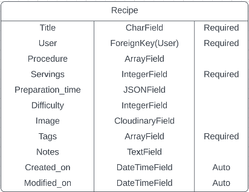
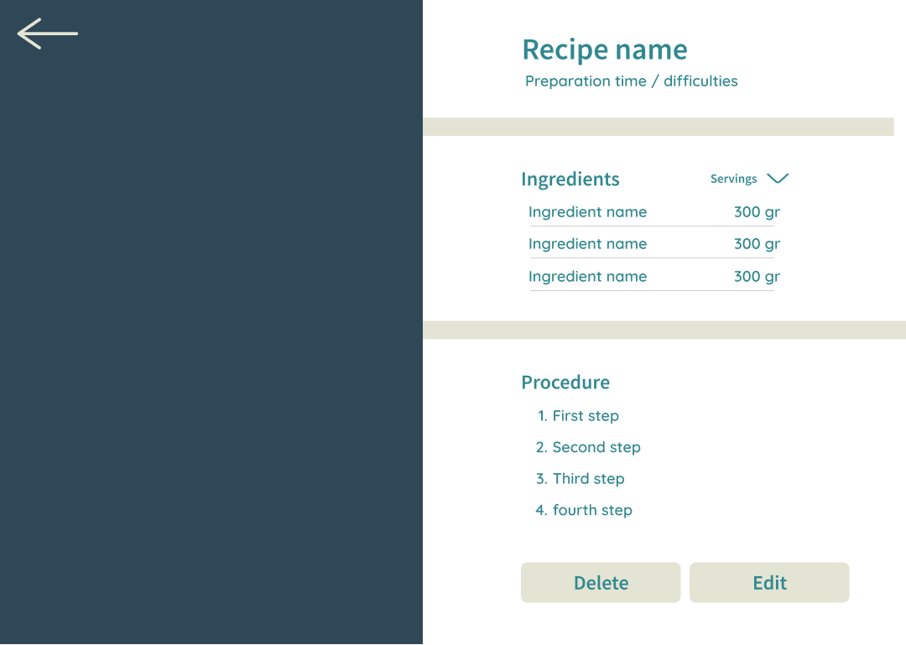
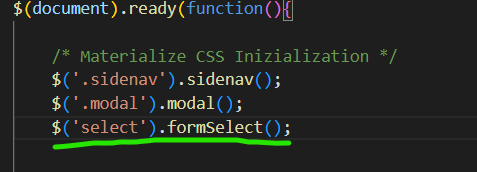
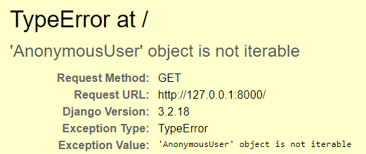
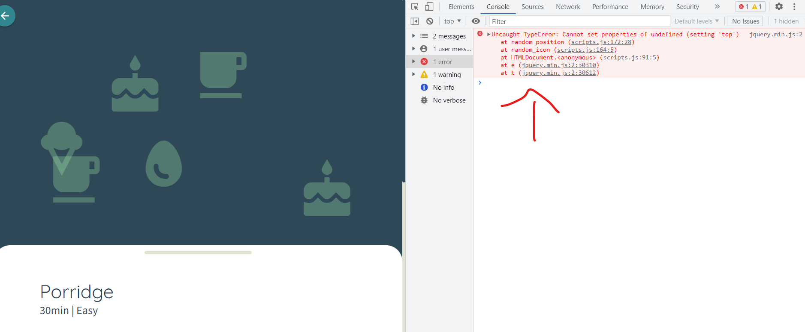
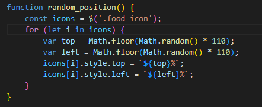
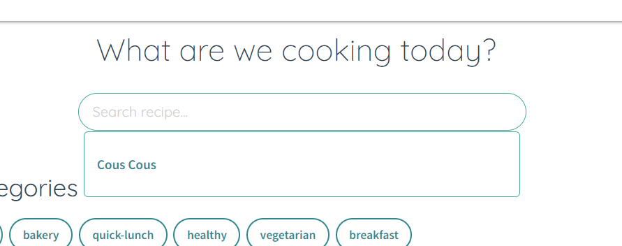

# yummy

Yummy is a recipe book web application, that allows users to save and store their recipes and access them from any device.

It is designed to fit both small and big screens.

[See deployed website](https://yummy-recipe-book.herokuapp.com/)

## Table of content

- [Design and User Experience](#design-and-user-experience)
  - [Design](#design)
  - [User Stories](#user-stories)
  - [Recipes database model](#recipes-model)
  - [Wireframes](#wireframes)

- [Features](#features)
  - [Landing Page](#landing-page)
  - [Dashboard](#dashboard)

- [Testing](#testing)
  - [Tests](#tests)
  - [Validator Testing](#validator-testing)
  - [Fixed bugs](#fixed-bugs)
  - [Unfixed bugs](#unfixed-bugs)
  - [Performance](#performance)

- [Deployment](#deployment)
  - [Live Website](#live-website)
  - [Local Deployment](#local-deployment)

- [Credits](#credits)
  - [Code](#code)
  - [Content](#content)

- [Technologies used](#technologies-used)

- [Acknowledgements](#acknowledgements)

## Design and User Experience

The web app was developed following the Agile methodology, utilizing the project functionality provided by GitHub
[Link to the project board](https://github.com/users/EliSacch/projects/5/views/1)

### Design

- Color palette:
  - Gradient:

  

  - Neutral:

  

  - Contrast:

  
  

### User Stories

- As a website user I can log into my personal area so that I can save and see my own recipes and not the ones from other users.

- As a first-time user I can receive a confirmation email when I sign up so that I know I entered the correct email.

- As a user I can reset my password so that I can recover access if I forgot my password.

- As a user I can have a dashboard with a clean design and clear navigation so that I know how to use all the features.

- As a user I can see and edit my personal information so that I can keep my information up to date.

- As a user I can add my recipe so that I can have them saved and I am able to review them whenever I need.

- As a user I can click on my recipes cards so that I can see all the details.

- As a user I can edit my recipes so that I don't need to delete them and add them from scratch if I want to change something.

- As a user I can delete a recipe so that I can keep just the ones I like.

- As a user I can search my recipes by name so that I don't have to scroll all the recipes to find the one I need.

- As a user I can see some random suggestions so that I can be inspired by my previous recipes.

### Recipes model

The recipes table will contain the following columns:

### Wireframes

  
Mobile

   
   
   
   
   
   
   
   
   

  
Desktop

   
   
   
   
   
   

## Features 

### Landing page

- __Login__

- __Signup__

### Dashboard

- __Header__

- __Search__

- __Add recipe__

## Testing 

### Tests

### Validator Testing

#### HTML

 Check if errors are returned when passing the final version through the official [W3C validator](https://validator.w3.org/nu/#textarea)

  

  
W3 - HTML validation screenshot

  
  

#### CSS

 Check if Errors are returned when passing the final version through the official [Jigsaw validator](https://jigsaw.w3.org/css-validator/validator)

  

  
W3 - CSS validation screenshot

  
  
  

#### JavaScript

Check if Errors are returned when passing the final version through the official [JsHint validator](https://jshint.com/), but only 4 warnings.

  
JsHint - JS validation screenshot

  

### Fixed Bugs

  
 Unable to load static files on Heroku:

  - Issue: The deployed app is not loading static files correctly, because it seems to add a Cloudinary file path in the middle.

  - Fix: After troubleshooting I could see that the issue was caused by the __DISABLE_COLLECTSTATIC__ Config Var, which I had not removed yet. After removing this Config Var the page loads correctly.

    

  
Error 500 when trying to reset password from Heroku

  - Issue: When trying to reset the password from the deployed website I received Server Error 500.

  - Fix: After troubleshooting I could see that the issue was caused by the Outlook SMTP credentials, and the issue was related not only to the reset password link, but to all SMTP functionalities. I decided to switch to Gmail SMTP which solved the issue.

  
Select Field not displaying options in form

  - Issue: When adding the select field to the 'Add recipes' form, the options where not showing and I could only see the label.

  - Fix: The issue was caused by the Materialize CSS form, which requires for the select fields to be initialized via JS.

  
Index page broke after adding function to provide suggested recipes

  - Issue: To provide the recipes suggestion, the function was filtering the results based on the user ID, so that users can see only their recipes. When I first implemented this option I was logged in as admin. After logging out I received this error.

  - Fix: The issue was caused by the Materialize CSS form, which requires for the select fields to be initialized via JS.

  
Randomize icons JS error

  - Issue: I have created a custom image placehoder to display when the user does not upload an image for the recipe. The functions creates random food icons and assign a random position.

  The function was working and displaying the icons in random positions, although it was giving an error in the console.

  

  This is the original code:

  

  - Fix: To fix this issue I changed the code as follow:

  

  
Update form creates new instance instead of updating the existing one

  - Issue numer 1: After creating the UpdateView for my recipes, the view was showing the correct template and pre-populating the fields with the selected recipe to be updated.
  Although when clicking on "Save", the form was crating a new instance, instead of updating the existing one.

  After investigation I could determine that the issue was created by the action url in the form, that was pointing to the add_recipe ursl, instead of edit_recipe url:
    

  - Fix: to solve this issue I changed the action url so that it could point to the correct url:
  

  - Issue numer 2: After changing this url although I received a second error, since the edit_url requires an argument (the primary key of the recipe):
    

  - Fix: To solve this issue I had to add 'pk' as argument for the link, and I had to pass the pk also in the context.

  
  

  
Username Form disappears if invalid form

  - Issue: When updating the usename form the ProfileView, if the form was invalid, the error message was displaying correctly, but the form field disappeared completely.

  

  - Fix: To fix this error, instead of returning "super().form_invalid(form)", I opted to redirect the user to the same page.
  The field reloads correctly, and an error message informs the user that the choosen username was invalid.

  
Search results not clearing if there is no value in the searchbar

  - Issue: When looking for recipes by name, the results are shown dynamically uderneatch the search bar. After some results were found, if the user tried and deleted all the charachters in the search field, the search result div was still showing the last results found.
  This was caused by the fact that all the logic was contained in the 'if' statement, which is fired only if the search string is longer then a minChar value. When deleting charachters from the search bar, the length of the search string was falling below the minChar value, so the search results array was not cleared.

  

  - Fix: To solve this issue I added an else statement, that hides the search results if the search string length is less then the minChar value.

  

  
 

### Unfixed Bugs

### Performance

## Deployment

### Deployment on Heroku

### Local Deployment
  - For a local deployment follow these steps:
    - Create a new directory on your machine, where you want do deploy the files
    - Open the existing repository in GitHub
    - Go to the "Code" tab
    - Click on the "Code" button
    - Copy the HTTPS link
    - Open your terminal and run the command __git clone 'link'__
    - use the link just copied, without quotes, instead of 'link'

## Credits 

### Code

- The code to filter the recipes by tag in the admin page is taken from [bradmontgomery](https://bradmontgomery.net/blog/django-admin-filters-arrayfields/)

- The code to dynamically add ne forms is taken from [CodingEnterpreneur tutorial](https://www.youtube.com/watch?v=s3T-w2jhDHE&t=1293s)

- The code to send an ajax request to show the search results is taken from [Very Academy tutorial](https://www.youtube.com/watch?v=Ct34iiOltgo)

### Content

- The color palette was generated using [Color Space](https://mycolor.space/)
- The recipe model was drawn using [Smart Draw](https://www.smartdraw.com/)

- The icons were taken from [Font Awesome](https://fontawesome.com/) and from [Google Fonts Icons](https://fonts.google.com/icons)

- The following fonts, used for the project, are from [Google Fonts](https://fonts.google.com/):
  - Quicksand
  - Source Sans Pro

The following Images are taken from [Unsplash](https://unsplash.com/photos/_h-2jrL9cMU?utm_source=unsplash&utm_medium=referral&utm_content=creditCopyText)

- Background image is from [Mae Mu](https://unsplash.com/@picoftasty?utm_source=unsplash&utm_medium=referral&utm_content=creditCopyText) 

- The favicon is from [Icons8](https://icons8.com/icon/A2GuNMcdfGfC/torta)

## Technologies used

  - HTML
  - CSS
  - JavaScript and JQuery
  - Python
  - Django
  - Materialize
  - PostgreSQL

  Django libraries
  - Allauth
  - inline forms
  - django-filters
  

## Acknowledgements

A special thank to my mentor __Dick Vlaanderen__ for his precious feedback on this project.

Tutor Ed