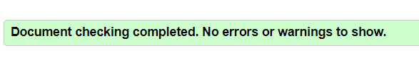
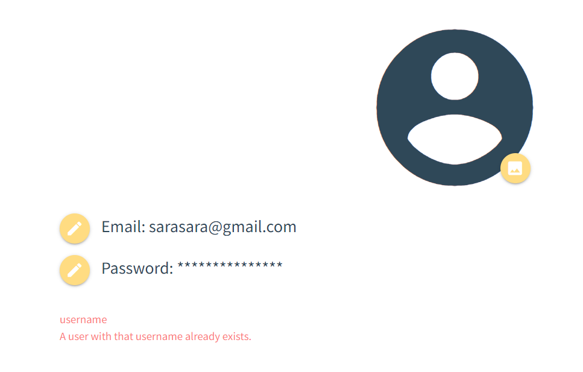

# Testing

Back to [main README](readme.md)

## Table of content

Testing
- [Tests](#tests)
    - [Unit test](#unit-test)
    - [Manual test](#manual-test)
- [Validator Testing](#validator-testing)
    - [HTML](#html)
    - [CSS](#css)
    - [JS](#javascript)
    - [Python](#python)
- [Fixed bugs](#fixed-bugs)
- [Unfixed bugs](#unfixed-bugs)
- [Performance](#performance)

## Tests

### Unit test

### Manual test

Home page before login

| Action | Expected result | Pass/Fail |
|--------|-----------------|-----------|
| Go to the web app link | The browser shows the home page before login, with the signup and ligin buttons | Pass |
| Click on the signup button | The user is redirected to the sign up form | Pass |
| Click on the button without any information filled out | A message prompts the user to enter the required information | Pass |
| Enter the email address only, and submit the form | A message prompts the user to fill out the username | Pass |
| Enter email and username and submit | A message prompts the user to enter the password | Pass |
| Enter email, username and password | A message prompts the user to re-enter the pssowrd | Pass |
| Enter all information, but type two different password | A message informs the user that the two passwords must match | Pass |
| Enter all information, but an inavlid username | A message informs the user that the username is invalid | Pass |
| Enter all information, but an invalid email | A essage informs the user that the email is not valid | Pass |
| Enter all valid information | The form submits and the user is informed that a verification email has been sent to their email address | Pass |

[Back to the top](#table-of-content)

## Validator Testing

### HTML

Check if errors are returned when passing the final version through the official [W3C validator](https://validator.w3.org/nu/#textarea)

Home page before login

- Errors: 0
- Warnings: 0

Sign up page

- Errors: 0
- Warnings: 0

Login page

- Errors: 0
- Warnings: 0

Reset password

- Errors: 0
- Warnings: 0

Dashboard after login

- Errors: 0
- Warnings: 0

My recipes page

- Errors: 0
- Warnings: 0

Recipe detail page

- Errors: 0
- Warnings: 0

Add Recipe page

- Errors: 0
- Warnings: 0

Edit Recipe

- Errors: 0
- Warnings: 0

Profile page

- Errors: 0
- Warnings: 0

Manage email page

- Errors: 0
- Warnings: 0

Change password page

- Errors: 0
- Warnings: 0

[Back to the top](#table-of-content)

### CSS

4 errors are returned when passing the final version through the official [Jigsaw validator](https://jigsaw.w3.org/css-validator/validator)

Although, these errors are caused by a new css property, that is still not widely supported.
  - 2 errors are related to the container-type property.
  - 2 errors are related to the cqw values.

W3 - CSS validation screenshot

These errors can be ignored, for the following reasons:

The Container-type property is actually a valid property, according to W3.

[Check on W3](https://www.w3.org/TR/css-contain-3/#propdef-container-type)

  - Accepted value: 	normal || [ size | inline-size ]
  - Applies to: All elements

Even if not supported on some browser, it does not affect the rest of the style, and it will simply be ignored when not supported.

Check browser support

This property is used, in this particular instance, to make this div a 'container', so that I can use the container-relative size for some chldren elements (cqw in this case)

[Check on W3](https://www.w3.org/TR/css-contain-3/#container-lengths)

This unit is become more an more supprted, although a fallback size was provided in both instances, so that I could reach a similar result also on unsuported browsers.

Check browser support

[Back to the top](#table-of-content)

### JavaScript

No errors are returned when passing the final version through the official [JsHint validator](https://jshint.com/)

  
JsHint - JS validation screenshot

  

[Back to the top](#table-of-content)

### Python

The final version of python files was checked using [CI Python Linter](https://pep8ci.herokuapp.com/#)

Se scrrenshots below:

  
Admin.py

  

  
Apps.py

  

  
Filters.py

  

  
Forms.py

  

  
Models.py

  

  
Urls.py

  

  
Views.py

  

[Back to the top](#table-of-content)

## Fixed Bugs

  
 Unable to load static files on Heroku:

  - Issue: The deployed app is not loading static files correctly, because it seems to add a Cloudinary file path in the middle.

  - Fix: After troubleshooting I could see that the issue was caused by the __DISABLE_COLLECTSTATIC__ Config Var, which I had not removed yet. After removing this Config Var the page loads correctly.

    

  
Error 500 when trying to reset password from Heroku

  - Issue: When trying to reset the password from the deployed website I received Server Error 500.

  - Fix: After troubleshooting I could see that the issue was caused by the Outlook SMTP credentials, and the issue was related not only to the reset password link, but to all SMTP functionalities. I decided to switch to Gmail SMTP which solved the issue.

  
Select Field not displaying options in form

  - Issue: When adding the select field to the 'Add recipes' form, the options where not showing and I could only see the label.

  - Fix: The issue was caused by the Materialize CSS form, which requires for the select fields to be initialized via JS.

  
Index page broke after adding function to provide suggested recipes

  - Issue: To provide the recipes suggestion, the function was filtering the results based on the user ID, so that users can see only their recipes. When I first implemented this option I was logged in as admin. After logging out I received this error.

  - Fix: The issue was caused by the Materialize CSS form, which requires for the select fields to be initialized via JS.

  
Randomize icons JS error

  - Issue: I have created a custom image placehoder to display when the user does not upload an image for the recipe. The functions creates random food icons and assign a random position.

  The function was working and displaying the icons in random positions, although it was giving an error in the console.

  

  This is the original code:

  

  - Fix: To fix this issue I changed the code as follow:

  

  
Update form creates new instance instead of updating the existing one

  - Issue numer 1: After creating the UpdateView for my recipes, the view was showing the correct template and pre-populating the fields with the selected recipe to be updated.
  Although when clicking on "Save", the form was crating a new instance, instead of updating the existing one.

  After investigation I could determine that the issue was created by the action url in the form, that was pointing to the add_recipe ursl, instead of edit_recipe url:
    

  - Fix: to solve this issue I changed the action url so that it could point to the correct url:
  

  - Issue numer 2: After changing this url although I received a second error, since the edit_url requires an argument (the primary key of the recipe):
    

  - Fix: To solve this issue I had to add 'pk' as argument for the link, and I had to pass the pk also in the context.

  
  

  
Username Form disappears if invalid form

  - Issue: When updating the usename form the ProfileView, if the form was invalid, the error message was displaying correctly, but the form field disappeared completely.

  

  - Fix: To fix this error, instead of returning "super().form_invalid(form)", I opted to redirect the user to the same page.
  The field reloads correctly, and an error message informs the user that the choosen username was invalid.

  
Search results not clearing if there is no value in the searchbar

  - Issue: When looking for recipes by name, the results are shown dynamically uderneatch the search bar. After some results were found, if the user tried and deleted all the charachters in the search field, the search result div was still showing the last results found.
  This was caused by the fact that all the logic was contained in the 'if' statement, which is fired only if the search string is longer then a minChar value. When deleting charachters from the search bar, the length of the search string was falling below the minChar value, so the search results array was not cleared.

  

  - Fix: To solve this issue I added an else statement, that hides the search results if the search string length is less then the minChar value.

  

[Back to the top](#table-of-content)

  
Server error 500 when signing up

  - Issue: when signing up for a new account, the server was unable to load the verification email template, due to a missing tag.

  - Fix: I added the missing tag "" and the issue was resolved.

  

## Unfixed Bugs

There are currently 0 known unfixed bugs

[Back to the top](#table-of-content)

## Performance

The website performance were measured using the Chrome built in tool __Lighthouse__

Home page begore login

Sign up page

Log in page

Password reset page

Dashboard

Detail page

Profile page

[Back to the top](#table-of-content)

Back to [main README](readme.md)